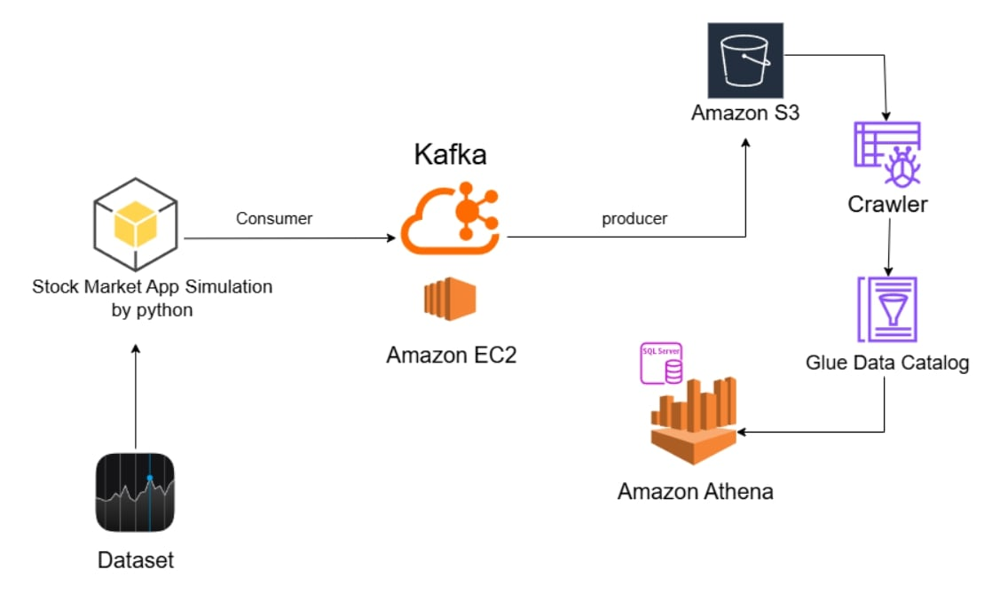

# 📊 Stock Market Real-Time Data Simulation with Kafka & AWS

This project simulates real-time stock market data using Python, Kafka, and AWS services. It demonstrates a complete data pipeline — from data simulation to querying through Amazon Athena.



## 🔧 Tech Stack

- **Python** – For stock market data simulation
- **Apache Kafka** – Streaming pipeline
- **Amazon EC2** – Kafka hosted on EC2
- **Amazon S3** – Data storage
- **AWS Glue** – Catalog and crawling
- **Amazon Athena** – Querying the data using SQL

---

## ⚙️ Architecture Flow

1. **Dataset**: A historical dataset is used to simulate live stock market data.
2. **Stock Market App (Python)**: Reads the dataset and acts as a **Kafka consumer**.
3. **Kafka on EC2**: Manages message streaming. The simulation app pushes data into Kafka (producer), and Kafka consumes it for processing.
4. **Amazon S3**: Stores the processed data in real-time.
5. **AWS Glue Crawler**: Crawls the S3 bucket to create metadata tables.
6. **AWS Glue Data Catalog**: Maintains metadata used for querying.
7. **Amazon Athena**: Allows SQL-based querying of the data stored in S3 using the metadata from Glue.

---

## 🚀 How to Run

### 1. Setup Kafka on EC2
- Launch an EC2 instance
- Install Kafka and ZooKeeper
- Configure a Kafka topic for stock data

### 2. Run the Simulation
```bash
python stock_simulation.py
